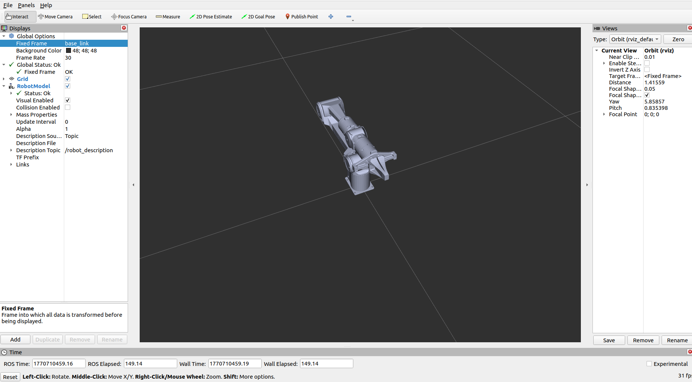
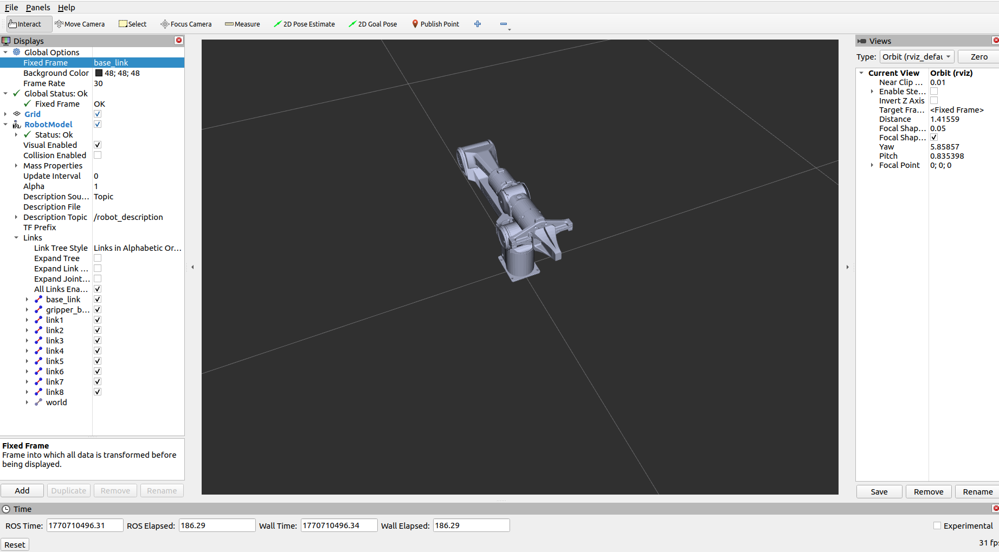
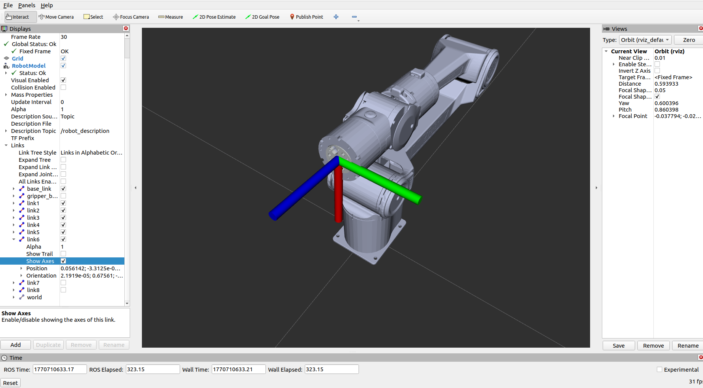
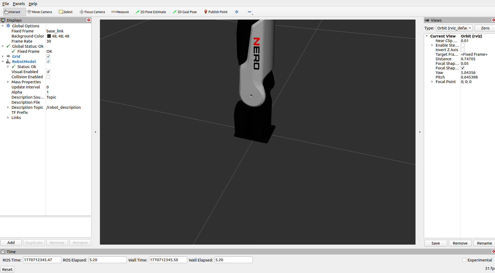
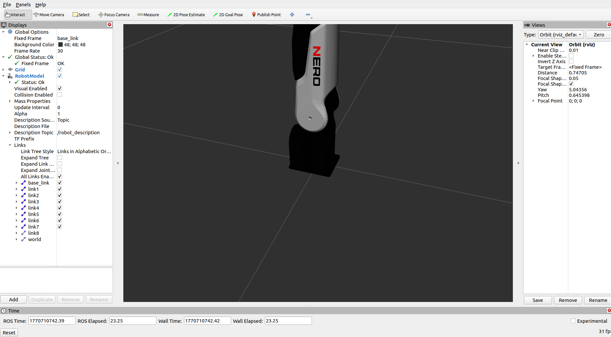
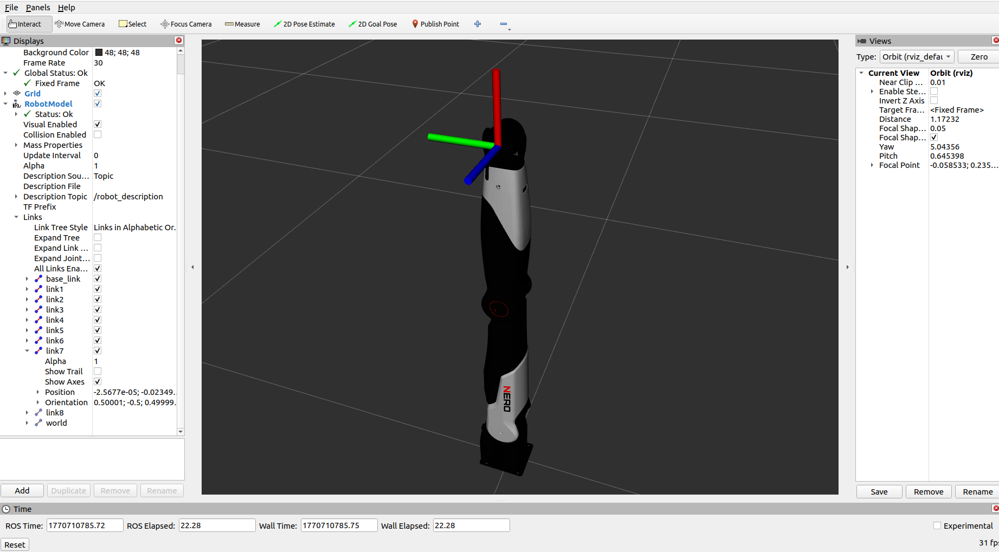

# TCP Offset Configuration

This document details the definition, units of the `tcp_offset` parameter, and the steps to view the flange center coordinate system via RViz, helping you accurately configure the Tool Center Point (TCP) offset.

## 1. Definition of tcp_offset Parameter

The 6 values of `tcp_offset` correspond to: `[x, y, z, rx, ry, rz]` in sequence. The meaning and unit of each dimension are as follows:

| Dimension | Unit | Description |
|-----------|------|-------------|
| x/y/z | Meter (m) | **Spatial position offset** of the tool center relative to the flange center |
| rx/ry/rz | Radian (rad) | **Attitude offset** of the tool center relative to the flange center |

## 2. View Flange Center Coordinate System (RViz Visualization)

Follow the steps below to visually check the flange center coordinate system of the robotic arm in RViz, which serves as a reference for TCP offset configuration.

### 2.1 Piper Robotic Arm

1. Open a terminal window and execute the corresponding commands to launch RViz visualization.
    ```bash
    cd ~/catkin_ws
    source install/setup.bash
    ros2 launch piper_description display_urdf.launch.py
    ```

2. Operations in the RViz interface:
    - Step 1: Select the correct coordinate system (refer to the screenshot)

        

    - Step 2: Expand the `RobotModel` in the left panel and enable the `Links` option

        
    
    - Step 3: Check the link you need to view in `Links` to display its coordinate system, and disable the display of other unnecessary links

        

### 2.2 Nero Robotic Arm

1. Open a terminal window and execute the corresponding commands to launch RViz visualization.
    ```bash
    cd ~/catkin_ws
    source install/setup.bash
    ros2 launch nero_description display_urdf.launch.py
    ```

2. Operations in the RViz interface:
    - Step 1: Select the correct coordinate system (refer to the screenshot)
    
        

    - Step 2: Expand the `RobotModel` in the left panel and enable the `Links` option
    
        

    - Step 3: Check the link you need to view in `Links` to display its coordinate system, and disable the display of other unnecessary links

        