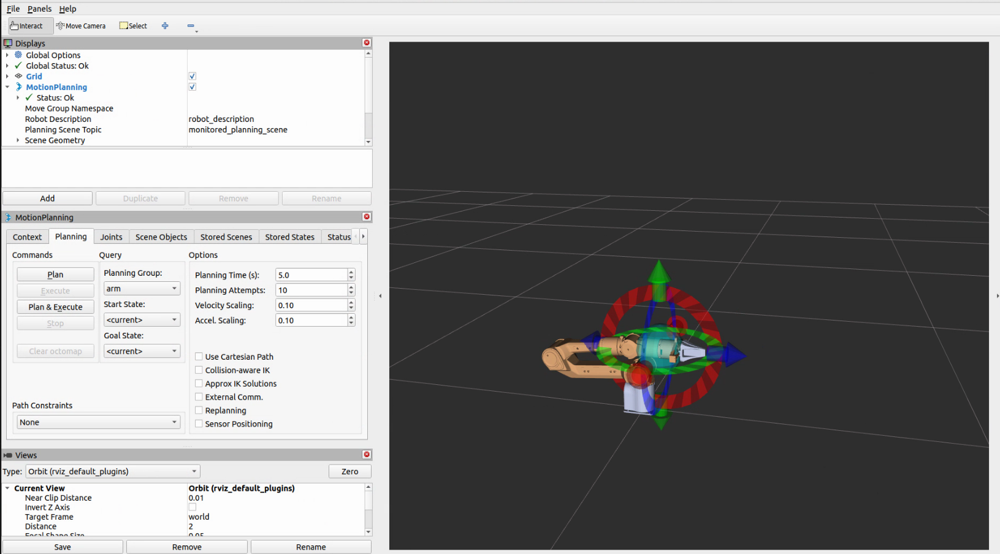

# agx_arm_moveit

[English](./README_EN.md)


|ROS |STATE|
|---|---|
|||
|||

> 注：安装使用过程中出现问题可查看[第4部分](#4-可能遇见的问题)

---

## 1 安装Moveit2

1）二进制安装，[参考链接](https://moveit.ai/install-moveit2/binary/)

```bash
sudo apt install ros-$ROS_DISTRO-moveit*
```

2）源码编译方法，[参考链接](https://moveit.ai/install-moveit2/source/)

---

## 2 安装依赖

安装完Moveit2之后，需要安装一些依赖

```bash
sudo apt-get install -y \
    ros-$ROS_DISTRO-control* \
    ros-$ROS_DISTRO-joint-trajectory-controller \
    ros-$ROS_DISTRO-joint-state-* \
    ros-$ROS_DISTRO-gripper-controllers \
    ros-$ROS_DISTRO-trajectory-msgs
```

若系统语言区域设置不为英文区域，须设置

```bash
echo "export LC_NUMERIC=en_US.UTF-8" >> ~/.bashrc
source ~/.bashrc
```

---

## 3 moveit2 控制真实机械臂

### 3.1 开启agx_arm_ctrl

启动 moveit2 前，先开启机械臂控制节点，详见：[agx_arm_ctrl](../../README.md)

### 3.2 moveit2控制

额外启动一个终端,运行以下指令:

```bash
cd ~/catkin_ws
source install/setup.bash
```

#### 3.2.1 无末端执行器运行

1. Nero 机械臂

    ```bash
    ros2 launch nero_no_effector_moveit demo.launch.py joint_states:=/control/joint_states
    ```

2. Piper 机械臂

    ```bash
    ros2 launch piper_no_effector_moveit demo.launch.py joint_states:=/control/joint_states
    ```

3. Piper_X 机械臂

    ```bash
    ros2 launch piper_x_no_effector_moveit demo.launch.py joint_states:=/control/joint_states
    ```

4. Piper_H 机械臂

    ```bash
    ros2 launch piper_h_no_effector_moveit demo.launch.py joint_states:=/control/joint_states
    ```

5. Piper_L 机械臂

    ```bash
    ros2 launch piper_l_no_effector_moveit demo.launch.py joint_states:=/control/joint_states
    ```

#### 3.2.2 有夹爪运行

1. Piper 机械臂

    ```bash
    ros2 launch piper_with_gripper_moveit demo.launch.py joint_states:=/control/joint_states
    ```

2. Piper_X 机械臂

    ```bash
    ros2 launch piper_x_with_gripper_moveit demo.launch.py joint_states:=/control/joint_states
    ```



可以直接拖动机械臂末端的箭头控制机械臂

调整好位置后点击左侧MotionPlanning中Planning的Plan&Execute即可开始规划并运动

## 4 可能遇见的问题

### 4.1 运行demo.launch.py时报错

报错：参数需要一个double，而提供的是一个string
解决办法：
终端运行

```bash
echo "export LC_NUMERIC=en_US.UTF-8" >> ~/.bashrc
source ~/.bashrc
```

或在运行launch前加上LC_NUMERIC=en_US.UTF-8
例如

```bash
LC_NUMERIC=en_US.UTF-8 ros2 launch piper_moveit_config demo.launch.py
```